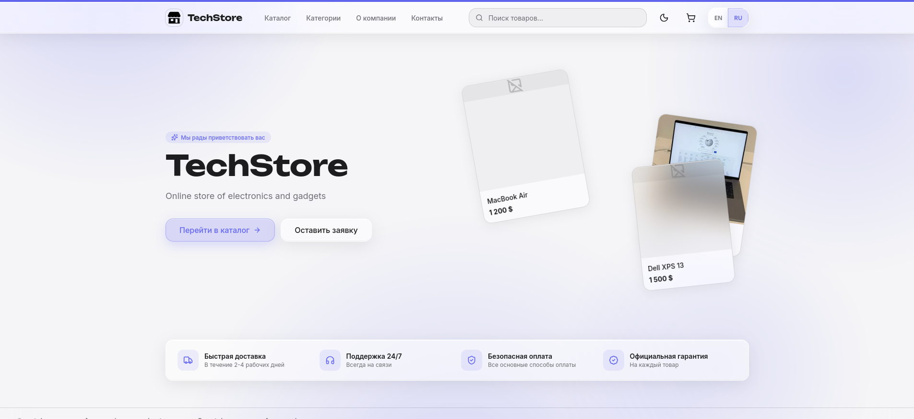
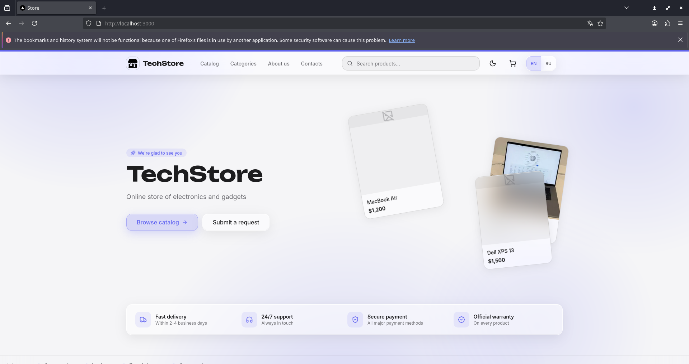
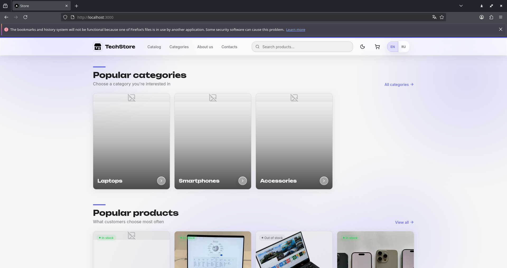
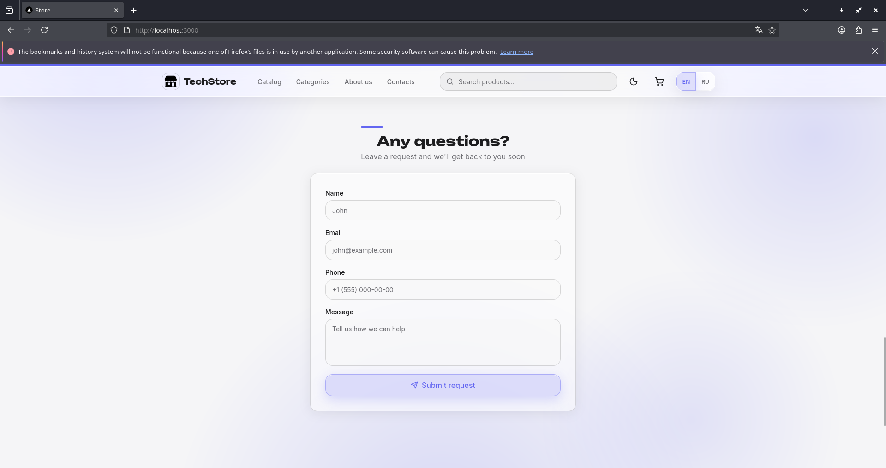
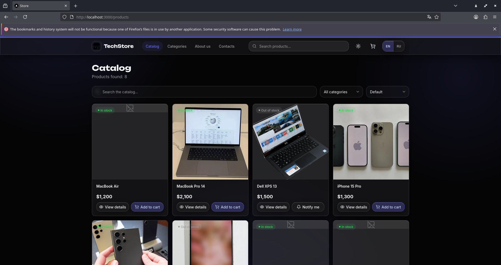
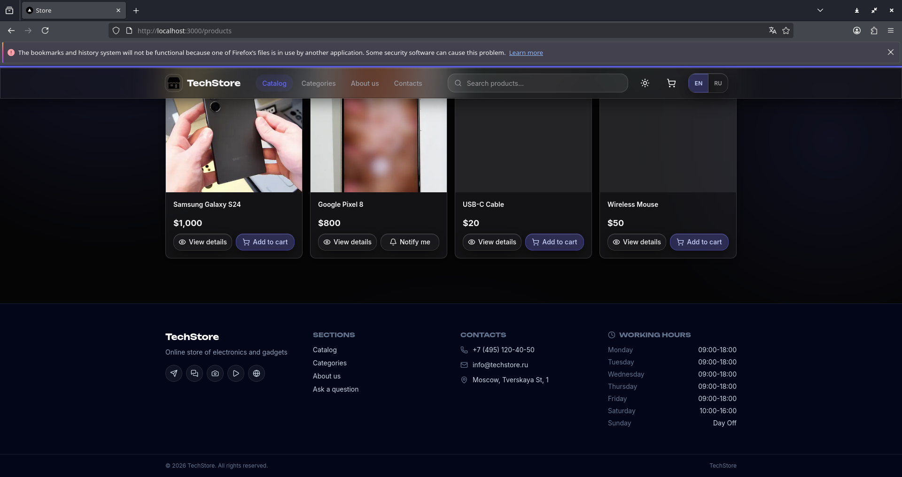
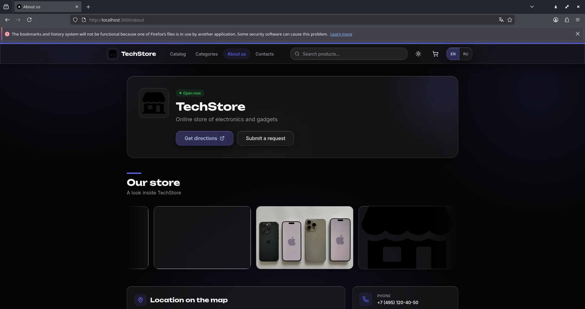
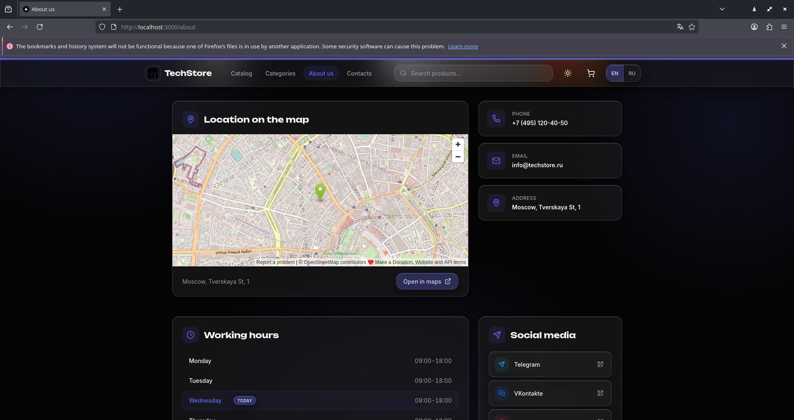
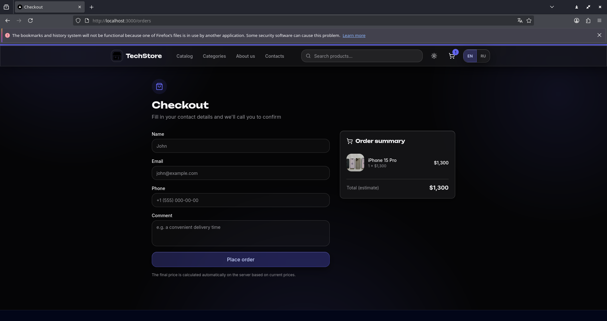
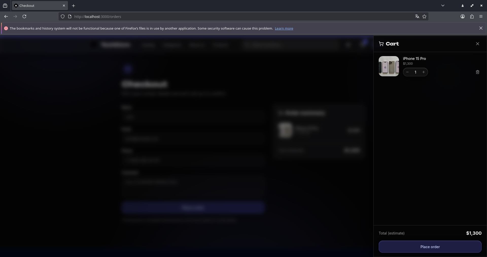

# TechStore

Full-stack e-commerce web application for an electronics store. It consists of a **Spring Boot (Java) REST API** backend and a **Next.js (React + TypeScript)** frontend with a distinctive **liquid-glass** design system, light/dark themes and English/Russian localization.

## Features

- **Catalog** — categories and products with pagination, sorting and search with live suggestions
- **Product pages** — image gallery with zoom, attributes, availability, related products
- **Cart & checkout** — slide-out cart drawer, order placement, order status and cancellation
- **Request forms** — "Ask a question" and "Notify when available" with validation
- **About page** — company info, working hours with live open/closed status, location on OpenStreetMap, auto-scrolling photo gallery, social links with generated QR codes
- **i18n** — English and Russian locales with an in-app switcher
- **Theming** — liquid-glass UI, light/dark modes (system-aware), `prefers-reduced-motion` support
- **Feature flags** — config endpoint toggles catalog/orders/availability sections
- **REST API** — validation, pagination, structured error responses, health endpoint

## Tech Stack

**Backend**

- Java 17, Spring Boot 3.2, Spring Web, Spring Data JPA, Bean Validation
- Flyway database migrations
- PostgreSQL (default) and SQLite (dev profile)
- Maven build

**Frontend**

- Next.js 16 (App Router), React, TypeScript
- Tailwind CSS v4 with a custom liquid-glass design system
- lucide-react icons, Google Fonts (Inter, Unbounded)

## Project Structure

```
├── src/main/java/          # Spring Boot backend
│   └── com/dekalib/app/
│       ├── controller/     # REST controllers
│       ├── dto/            # request/response records
│       ├── entity/         # JPA entities
│       ├── exception/      # error handling
│       ├── repository/     # Spring Data repositories
│       └── service/        # business logic
├── src/main/resources/
│   ├── application.yml             # default (PostgreSQL) config
│   ├── application-sqlite.yml      # SQLite dev profile
│   ├── data.sql                    # seed data (dev profile)
│   └── db/migration/               # Flyway migrations
├── frontend/               # Next.js frontend
│   └── src/
│       ├── app/            # pages (App Router)
│       ├── components/     # UI, layout, cart, forms, about
│       ├── context/        # site, cart, locale providers
│       ├── lib/            # API client, i18n, helpers
│       └── types/          # TypeScript types
└── screenshots/            # application screenshots
```

## Getting Started

### Prerequisites

- JDK 17+
- Node.js 20+
- Maven 3.9+

### 1. Backend

**SQLite profile (recommended for quick start — no database setup needed):**

```bash
mvn package -DskipTests
java -jar target/web-app-template.jar --spring.profiles.active=sqlite
```

The SQLite database `webapp.db` is created automatically in the project root and seeded from `data.sql` on startup. The API is available at `http://localhost:8080`.

**PostgreSQL (default profile):**

```bash
mvn package -DskipTests
java -jar target/web-app-template.jar
```

Requires a PostgreSQL database (defaults: `jdbc:postgresql://localhost:5432/webapp`, user/password `postgres`/`postgres`). Schema is applied by Flyway from `db/migration/V1__init.sql`.

### 2. Frontend

```bash
cd frontend
npm install
npm run build
npm start
```

The frontend is served at `http://localhost:3000`. For development with hot reload use `npm run dev` instead.

> `npm start` (Next.js `next start`) serves the production build, so run `npm run build` before starting or after every change.

## Configuration

Backend settings can be overridden via environment variables:

| Variable | Default | Description |
| --- | --- | --- |
| `PORT` | `8080` | Backend port |
| `DB_URL` | `jdbc:postgresql://localhost:5432/webapp` | PostgreSQL JDBC URL |
| `DB_USERNAME` | `postgres` | DB user |
| `DB_PASSWORD` | `postgres` | DB password |
| `SQLITE_DB_URL` | `jdbc:sqlite:webapp.db` | SQLite JDBC URL |
| `FRONTEND_URL` | `http://localhost:3000` | Frontend origin (CORS) |

Feature flags in `application.yml` (`app.features.catalog`, `app.features.orders`, `app.features.availability-requests`) control which sections the frontend renders.

## API Endpoints

Base path: `/api/v1`

| Method | Path | Description |
| --- | --- | --- |
| `GET` | `/health` | Health check |
| `GET` | `/config` | App config & feature flags |
| `GET` | `/company` | Company info (contacts, socials, location, photos) |
| `GET` | `/company/contacts` | Company contacts & working hours |
| `GET` | `/categories` | List of categories |
| `GET` | `/categories/{slug}` | Category by slug |
| `GET` | `/categories/{slug}/products` | Products of a category |
| `GET` | `/products` | Paginated products (`page`, `size`, `sort`, `categorySlug`, `query`) |
| `GET` | `/products/{slug}` | Product details |
| `GET` | `/products/{slug}/related` | Related products |
| `GET` | `/products/{slug}/availability` | Product availability |
| `POST` | `/orders` | Create an order |
| `GET` | `/orders/{id}` | Order details |
| `POST` | `/orders/{id}/cancel` | Cancel an order |
| `POST` | `/requests` | Submit a customer request |
| `POST` | `/availability-requests` | Submit an availability request |

## Screenshots











